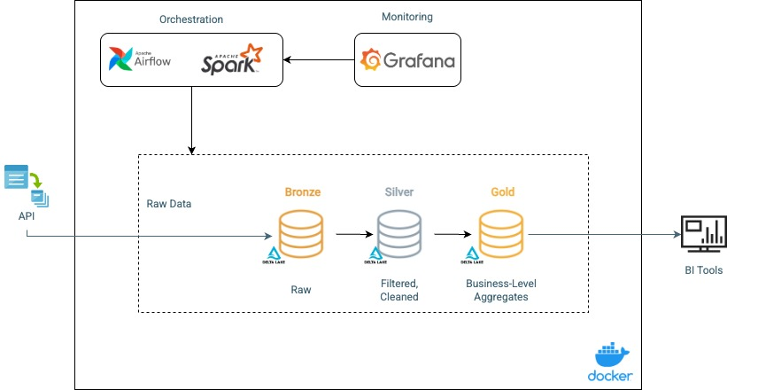

# Data Engineering – Breweries Case

____
# Author
* **Patrick Martini**
* [Linkedin](https://www.linkedin.com/in/patrickmartinni/)
____
# Objective
This data pipeline retrieves brewery data from the **Open Brewery DB API** and follows the `medallion architecture`, performing data ingestion and transformation through the Bronze, Silver and Gold layers.
The pipelin utilizes:
* `PySpark` for data processing
* `Airflow` for orchestration
* `Docker` environment configuration

The processed data is stored in `Delta Lake` tables.


# Project Structure
```
Breweries_Case/
│── dags/                    # Airflow DAGs
│   ├── spark_airflow.py     # DAG for the Breweries ETL process 
│── grafana/                 # Grafana files
│   ├──dashboards/           # Grafana dashboards scripts 
│── logs/                    # Logs generates by Airflow
│── output/                  # output files from ETL process
│── scripts/                 # PySpark scripts for data processing
│   ├── bronze_process.py    # ETL script for bronze layer
│   ├── gold_process.py      # ETL script for gold layer
│   ├── silver_process.py    # ETL script for silver layer
│   │── validations/         # Directory for validation scripts
│── Dockerfile               # Custom Airflow image with PySpark
│── docker-compose.yaml      # Docker Compose configuration
│── readme.md                # Project documentation
│── requirements.txt         # Python dependencies

```
# Requirements
Before running the pipeline, make sure Docker is installed. If not, follow oficial installment instructions bellow:
* [Install Docker](https://docs.docker.com/get-started/get-docker/)

# Setup & Installation
## 1. Clone Repository
```bash
git clone https://github.com/trickmartini/BEES_Breweries_Case.git
```
## 2. Create required directories `.env` File
Run the following command in the terminal:
```bash
mkdir -p ./logs
echo -e "AIRFLOW_UID=$(id -u)" > .env
```
## 3. Build and Start the Containers
```bash
docker-compose up -d --build
```
This will: 
* Build Airflow image with PySpark dependencies.
* Start Airflow and Spark containers.
* Start and Configure Grafana services.

# Running Pipeline
## Triggering the pipeline via Airflow Web Interface
You can manually trigger the pipeline using the Airflow Web Interface.
> **Credentials for Airflow UI**:
>- **Username**: ``airflow``
>- **Password**: ``airflow``
### Steps:
1. Open Airflow UI and navigate to the `DAGs` section
2. Locate and open  `breweries_etl_process`
3. Click on `Trigger DAG` to start the process.

### Monitoring Executions & Logs
* To track execution progress, go to the `Graph` view. 
* Click on any step to see its detailed logs under the `Logs` section.
* Use Grafana dashboards to monitor the pipeline's execution metrics and system performance in real time. Check how to use it in the Monitoring and DAta Quality section.
# Pipeline Architecture
## Overall


This ETL process retrieves data from the Open Brewery DB API and process it through the Bronze, Silver and Gold layers.
Data available in Gold layer can be used for data visualization tools(e.g., Power BI, Tableau) or queried via SQL interface.
Additionally, Grafana dashboards are utilized for monitoring.

## Technology stak
This project utilizes PySpark for ETL processing due to its high performance, especially when handling large-scale data in a distributed and efficient manner. PySpark also provides scalability, allowing the process to adapt seamlessly to different workloads while ensuring flexibility and robustness.

For workflow orchestration, Apache Airflow was chosen as it is a comprehensive orchestration tool with strong integration capabilities across various technologies. Airflow provides advanced features such as task dependency management, execution monitoring, and dynamic pipeline creation, offering greater control and automation over ETL processes.

The combination of Airflow and PySpark ensures a scalable and reliable execution environment, enabling scheduling, tracking, and debugging of data workflows efficiently. Additionally, this approach facilitates integration with storage, visualization, and monitoring tools, delivering a complete and maintainable data pipeline solution.

## Bronze Process
The Bronze Process is responsible for raw data ingestion from the **Open Brewery DB API** and storing it in the Bronze layer using Delta Lake.

### Process Flow
1. Data Extraction:
* The API is called iteratively to retrieve data in batches using pagination.
* If the API response is empty, the extraction process is terminated.
* The raw data is saved locally as a JSON file.
2. Writing Data to Delta Lake:
* If the Bronze table exists, the process checks for changes column by column:
  * If no changes are detected, the record is ignored.
  * If changes detected, the validity of the old record is closed (end_timestamp is updated with the current timestamp), and a new updated record is inserted with a new validity period.
* If the table does not exist, the extracted API data is directly inserted into the Bronze layer, adding control columns:
  * start_timestamp: Marks the record’s insertion time.
  * end_timestamp: Indicates the record’s expiration time (initially set to NULL).

## Silver Process
The Silver Process is responsible for data transformation and standardization, ensuring consistency and improving data quality before it moves to the Gold Layer. This process also optimizes data for analytical consumption using Delta Lake.
### Process Flow
1. Data Filtering:
* Reads data from the Bronze Layer, considering only active records (`end_timestamp IS NULL)
* If the Bronze table is empty, the process is terminated with a warning.
2. Data Cleaning & Standardization:
* Trimming: Removes leading/trailing spaces from text fields.
* Latitude & Longitude Casting: Converts latitude and longitude to DoubleType() for improved compatibility with BI tools.
* Phone Number Normalization: Converts phone numbers to E.164 format, keeping only numeric characters and prefixing with "+".
3. Data Storage & Updates (SCD Type 1):
* If the Silver Table does not exist,  the transformed data is written with an additional `update_timestamp` for tracking.
* If the Silver Table already exists, a MERGE operation is performed:
  * New Records inserted as a new entry.
  * If a record already exists and the update_timestamp in Silver is older than the start_timestamp from Bronze, the record is updated with the latest values.

# Gold Process
This process reads data from Silver layer, aggregates it, and writes the results to the Gold layer.
It generates the following table: 
* `breweries_by_location` --> aggregated by: `country, state, city, brewery_type`

This table can be consumed by data visualization tools (e.g., Power BI, Tableau). 

Since it is aggregated at different hierarchical levels, it supports `drill-down` and `drill-up` visualizations.


# Monitoring and Data Quality

## Monitoring
To enhance pipeline monitoring and observability, Grafana was integrated into the architecture. Grafana was chosen for its real-time visualization capabilities, allowing efficient tracking of ETL workflows and system performance. It provides a user-friendly interface with custom dashboards that display critical execution metrics, ensuring better control and decision-making regarding the pipeline’s health.

Dashboards Overview
Three key dashboards were created to monitor the Airflow pipelines:

1. DAG Execution History Dashboard
* Displays all DAG executions within a selected time period.
* Helps analyze execution patterns and identify potential bottlenecks.
2. Latest DAG Execution Status Dashboard
* Shows the latest execution status of each DAG in the system.
* Useful for quickly identifying failed or pending DAGs that need attention.
3. Execution Success & Failure Trends Dashboard
* Tracks the number of successful and failed DAG executions over time.
* Helps detect anomalies or trends that could indicate issues with data ingestion, transformations, or system performance.

### How to access Grafana
1. Open Grafana UI, go to: http://localhost:3000/
2. Log in using the following credentials:
   * user: `admin`
   * password: `admin`
3. Navigate to `Dashboards > Breweries Monitoring` to view real-time execution metrics.

## Data Quality & Error Handling
## Bronze Layer
1. Implement API retry logic, limiting to 3 attempts to ensure reliability in case of temporary failures. 

### Silver Layer
1. Ensure data type consistency by transforming fields to their expected types.
2. Validate input data by checking if the DataFrame is empty before proceeding.
3. Validate output data by ensuring the transformed DataFrame is not empty before writing.
4. Identify and handle inconsistent records, such as those with `null` values in critical fields (`id`, `country`, `state`, `city`, or `brewery_type`), as these fields are essential for this specific workflow.
5. Since this validation is part of the Airflow DAG execution process, any test failures result in a failed DAG execution. This ensures that incorrect or incomplete data is not delivered to subsequent layers, maintaining data integrity and reliability.

## Gold Layer
1. Validate input data by checking if the DataFrame is empty before proceeding.
2. Check if the resulting DataFrame is empty before writing, preventing unnecessary writes of incomplete or missing data.

# Useful Commands
| Action                   | Command                   |
|--------------------------|---------------------------|
| Start Airflow & Spark    | docker-compose up --build | 
| Stop All Containers      | docker-compose down       |
| Restar Airflow           | docker-compose restart    |
| Check DAGs in Airflow UI | Open [Airflow UI](http://localhost:8080 )       |

